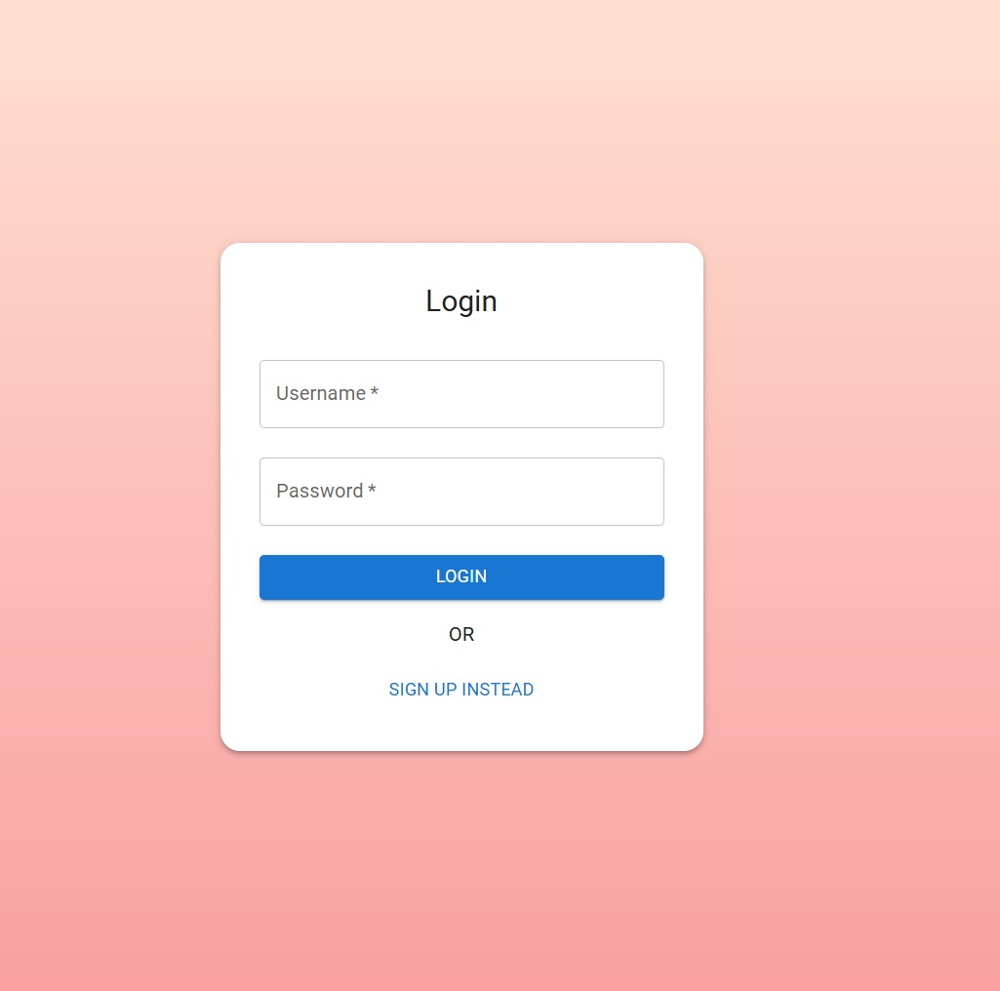
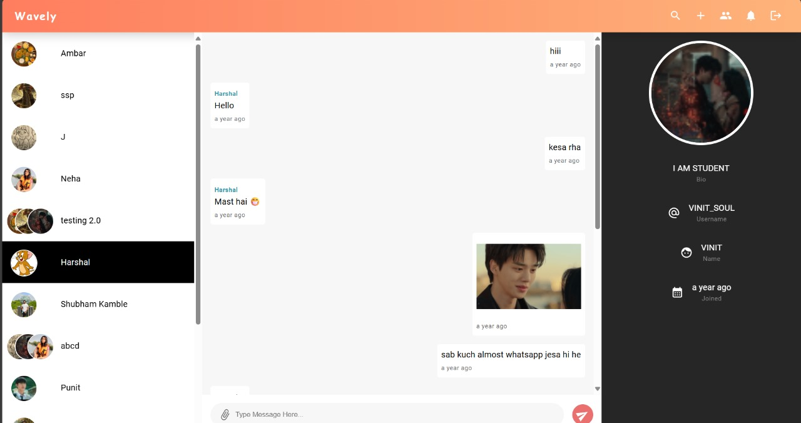

# 💬 Wavely – Real-time Chat Application

Wavely is a full-stack real-time chat application built using the **MERN** stack with **Socket.io** for WebSocket-based communication. It supports 1-to-1 and group messaging, file sharing, notifications, and user presence — all within a clean, responsive interface.

---

## 🌐 Live Demo
[](https://frontend-2-2vjy.vercel.app/)

---

## 🛠 Tech Stack

- **Frontend**: React.js, Material UI (MUI), Redux, RTK Query  
- **Backend**: Node.js, Express.js, MongoDB  
- **Real-time**: Socket.io (WebSockets)  
- **Auth**: JWT  
- **File Upload**: Multer  
- **Deployment**: Render, Vercel  

---

## 🚀 Features

- 🔐 Secure login/signup with JWT-based authentication  
- 💬 Real-time chat with WebSocket (Socket.io)  
- 🧑‍🤝‍🧑 Group chats with up to 400 users  
- 📁 File sharing (images/docs) in messages  
- 📢 Typing indicators, online/offline presence  
- 📱 Fully responsive UI using MUI  
- 🔍 Chat search and member management  

---

## 📸 Screenshots

| Login | Chat UI |
|-------|---------|
|  |  |


---

## 🧑‍💻 Getting Started

```bash


# Install backend dependencies
npm install

# Navigate to frontend
cd Frontend
npm install

# Start both servers
npm run dev
